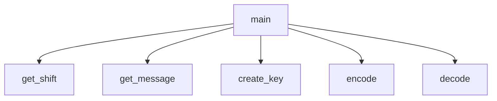

# Caesar Cipher
Created by Tate Basham and Henry Baier

## Caesar Cipher Description
It requests a message to encode/decode, which will use a caesar cipher to do so.

### Caesar Cipher Flowchart

#### Function Diagrams

| `main`    |               |  Tate B     |
| ------------------ | ------------- | ------------ |
| `argument:type`    | calls functions  |              |
| `time:integer`     |   | outputs n/a             |
| `name:string`      |  | returns n/a |

| `get_shift`    |               |     Henry B.   |
| ------------------ | ------------- | ------------ |
| `argument:none`    | prompts the user for a shift value  |              |
| `shift:integer`     | validates for integers between 1-25, inclusive  | outputs nothing             |
| `shift:integer`      |  | returns shift |

| `choose_option`    |               |    Tate B.   |
| ------------------ | ------------- | ------------ |
| `argument:none`    | prompts the user to select encode or decode  |              |
| `option:str`     |   | outputs nothing             |
| `option:str`      |  | returns option |

| `get_message`    |               |    Henry B.   |
| ------------------ | ------------- | ------------ |
| `argument:none`    | prompts the user for a message  |              |
| `message:str`     |   | outputs nothing             |
| `message:str`      |  | returns message |

| `create_key`    |               |    Tate B.   |
| ------------------ | ------------- | ------------ |
| `argument:shift`    |accepts shift  |              |
| `message:str`     | creates a cipher key   | outputs nothing             |
| `message:str`      |  | returns key |

| `encode`    |               |    Henry B.   |
| ------------------ | ------------- | ------------ |
| `argument:message, key`    |accepts message and key  |              |
| `message:str`     | encodes the message as a string using the key   | outputs encoded_message          |
| `message:str`      |  | returns encoded_message |

| `decode`    |               |    Tate B.   |
| ------------------ | ------------- | ------------ |
| `argument:message, key`    |accepts message and key  |              |
| `message:str`     | decodes the message as a string using the key   | outputs decoded_message          |
| `message:str`      |  | returns decoded_message |
***
# TATE JAMES BASHAM IS SO SPECIAL!
# TATE JAMES BASHAM IS SO SPECIAL!
# TATE JAMES BASHAM IS SO SPECIAL!
# TATE JAMES BASHAM IS SO SPECIAL!
# TATE JAMES BASHAM IS SO SPECIAL!
# TATE JAMES BASHAM IS SO SPECIAL!
# TATE JAMES BASHAM IS SO SPECIAL!
# TATE JAMES BASHAM IS SO SPECIAL!
# TATE JAMES BASHAM IS SO SPECIAL!
# TATE JAMES BASHAM IS SO SPECIAL!
# TATE JAMES BASHAM IS SO SPECIAL!
# TATE JAMES BASHAM IS SO SPECIAL!
# TATE JAMES BASHAM IS SO SPECIAL!
# TATE JAMES BASHAM IS SO SPECIAL!
# TATE JAMES BASHAM IS SO SPECIAL!
# TATE JAMES BASHAM IS SO SPECIAL!
# TATE JAMES BASHAM IS SO SPECIAL!
# TATE JAMES BASHAM IS SO SPECIAL!
# TATE JAMES BASHAM IS SO SPECIAL!
# TATE JAMES BASHAM IS SO SPECIAL!
# TATE JAMES BASHAM IS SO SPECIAL!
# TATE JAMES BASHAM IS SO SPECIAL!
