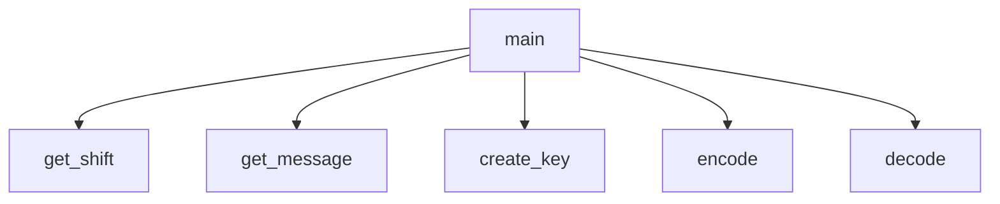

# Caesar Cipher
## Created by Tate Basham and Henry Baier

## Caesar Cipher Description
It requests a message to encode/decode, which will use a caesar cipher to do so.

### <program_name> Flowchart

#### Function Diagrams

| `main`    |               |  author     |
| ------------------ | ------------- | ------------ |
| `argument:type`    | takes input from the user for ____  |              |
| `time:integer`     | calculates ______  | outputs ____             |
| `name:string`      | takes input for name ___ | returns total |
***
| `function name2`    |               |     author   |
| ------------------ | ------------- | ------------ |
| `argument:type`    | takes input from the user for ____  |              |
| `time:integer`     | calculates ______  | outputs ____             |
| `name:string`      | takes input for name ___ | returns total |
***
